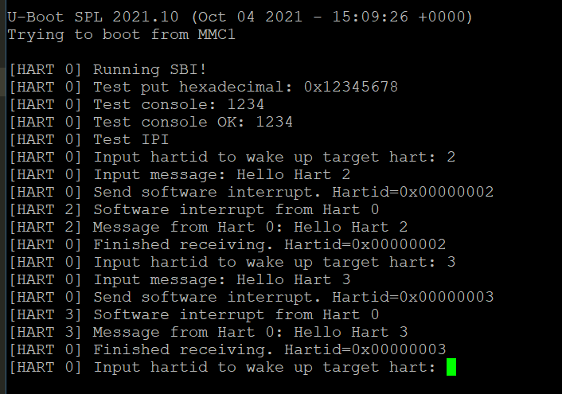

## 启动S7核


#### 硬件背景

以下是一些相关的特性，具体参见[官方文档](https://sifive.cdn.prismic.io/sifive/de1491e5-077c-461d-9605-e8a0ce57337d_fu740-c000-manual-v1p3.pdf)


|Feature|Description|
|---|---|
|ISA|RV64IMAC|
|Modes|Machine Mode, User Mode|
|L1 i-cache|16KiB 2-way i-cache|
|DTIM|8 KiB DTIM|
|L2 Cache|2 MiB 16-way L2 cache with 4 banks|
|ECC|Single error correction, double error detection on the DTIM and L2 cache|
|Fast IO|Present|
|PMP|8 regions with a granularity of 64 bytes|

启动S7核，核心的问题在于S7核只有M态和U态，官方给出的boot链中，U-Boot是工作在S态的，所以需要在官方boot链的基础上，加入自己的启动代码。

#### 启动准备

* 在整个boot链中，我们不能修改的部分是ZSBL，也就是板子出厂时烧写在ROM中的代码，这段代码主要工作是根据板子上的MSEL控制开关，由**Hart 0**将更复杂的U-Boot SPL程序从分区加载到L2 LIM中执行，对应地址为`0x08000000`。
* 如果想移除U-Boot SPL，并添加自己的FSBL（First Stage Bootloader），需要对启动位置（SD卡，Flash等）的第一个分区（GUID 5B193300-FC78-40CD-8002-E86C45580B47）进行覆写。对于SD卡，具体操作方法为直接执行如下命令：
```shell
# 将SD卡制作成如下分区格式
sudo sgdisk -g --clear -a 1 \
	  --new=1:34:2081         --change-name=1:spl --typecode=1:5B193300-FC78-40CD-8002-E86C45580B47 \
	  --new=2:2082:10273      --change-name=2:uboot  --typecode=2:2E54B353-1271-4842-806F-E436D6AF6985 \
	  --new=3:16384:282623    --change-name=3:boot --typecode=3:0x0700 \
	  --new=4:286720:13918207 --change-name=4:root --typecode=4:0x8300 \
	  /dev/sdX
# 覆写FSBL的二进制文件
dd if=<your fsbl>.bin of=/dev/sdX seek=34
```
* 不建议替换或修改U-Boot SPL，因为这一部分进行了一系列的硬件初始化工作，为之后的程序执行提供了硬件环境，且后续阶段代码的修改更加灵活，相比之下，修改U-Boot SPL的意义也不是很大。如果对FSBL的具体操作感兴趣，可阅读U-Boot开源代码，但由于U-Boot已经相当完善，项目过于庞大，不适合上手，建议阅读上一代[`Hifive Unleashed`启动流程](https://github.com/sifive/freedom-u540-c000-bootloader)，采用的是裸机程序。

#### 启动流程

##### SD卡默认分区简介

- `/spl`：U-Boot SPL
- `/uboot`：U-Boot Proper、OpenSBI generic FW_DYNAMIC、DTB with U-Boot overlay
- `/boot`：FAT16分区，包含设置信息(EXTLINUX configuration)，内核镜像以及设备树信息(device tree blob)
- `/root`：EXT4分区，包含由**FUSDK**构建的文件系统

##### 制作镜像

* 首先准备好制作镜像时的分区配置信息：

```log
/dts-v1/;

/ {
    description = "tCore Image";
    #address-cells = <1>;

    images {
        sbi {
            data = /incbin/("../sbi/sbi.bin");
            description = "SBI for tCore";
            type = "firmware";
            os = "sbi";
            arch = "riscv";
            compression = "none";
            load = <0x80000000>;
            entry = <0x80000000>;
        };
        kernel {
            data = <0x0 0x0 0x0 0x0>;
            description = "tCore Image";
            type = "standalone";
            os = "tCore";
            arch = "riscv";
            compression = "none";
            load = <0x80200000>;
        };
        fdt-1 {
            description = "hifive-unmatched-a00";
            type = "flat_dt";
            compression = "none";
            data = [...];
        };
    };

    configurations {
        default = "unmatched-sdcard";

        unmatched-sdcard {
            description = "hifive-unmatched-a00";
            firmware = "sbi";
            loadables = "kernel";
            fdt = "fdt-1";
        };
    };
};
```

* 如上面的分区配置所示，完整的文件[参考](https://github.com/tkf2019/tCore/tree/main/bin)，完整文件中包含了U-Boot Proper可识别的fdt信息，且原始的配置信息中，Kernel位置的是U-Boot Proper文件，已经将默认的Kernel位置的data注释掉了，因此，如果想在S7核上运行内核，可以选择将内核的二进制放在Kernel的位置；如果在U7核上运行内核，可以采用官方默认的U-Boot的启动办法。但是如果想不同的核同时运行不同的内核，欢迎持续关注[RustSBI](https://github.com/rustsbi/rustsbi-hifive-unmatched)的更新情况，后续会引入功能：SBI根据`misa`等信息判断当前硬件支持的特权级别，并选择不同的加载方式。
* 执行以下命令覆写SD卡对应分区：

```shell
mkimage -f sd-image.dts target.img
dd if=target.img of=/dev/sdX seek=2082
```

#### [运行实例](https://github.com/tkf2019/tCore/tree/main/sbi)

> 利用以上的流程，在`Hifive Unmatched`上运行多核通信的简易demo，用于说明SBI启动后主要进行的工作和相关硬件特性的利用。

* 首先进入sbi文件夹，插入SD卡后，修改Makefile中`image`任务的`of`内容为SD卡挂载的位置（可通过`sudo fdisk -l`查看），执行`make image`命令即可制作镜像并将镜像写入SD卡
* 演示用SBI入口地址为`0x80000000`，因为U-Boot SPL在初始化结束并加载第二分区后，会默认跳转到这一地址执行。
* 对于`uart`、`clint`等设备，读写采用原子操作，参考了OpenSBI相关实现
* 阻塞通信逻辑：
  * 小核和大核均清空clint软件中断，写入mie开启软件中断，然后大核进入循环等待消息；
  * 小核向大核发出中断后，在预先协商好的地址`0x80100000`处写入通信内容，然后进入wfi等待唤醒；
  * 大核接收到软件中断，从循环中跳出并输出一段信息报告当前硬件Hartid，并在串口打印小核之前在`0x80100000`写入的通信内容，最后向小核发送软件中断，进入wfi等待唤醒；
  * 小核收到软件中断后重新执行以上步骤，由此便实现了多核之间的简易通信
* 等待软件中断相关代码：
```c
int wait_ipi(size_t hartid) {
    // loop and wait for software interrupt
    while (!(read_csr(mip) & MIP_MSIP)) 
        wfi();
    // receive software interrupt now
    clint_clear_soft(hartid);
    return 0;
}
```
* 运行效果：



#### 启动日志

-   （2021.11.18）OpenSBI首先进行一系列初始化，然后进行二级跳转到uboot，由于uboot运行在S态，无法在S7上加载程序，因此要重新配置OpenSBI
    -   论坛上的一个建议：可以通过向S7发送软件中断来唤醒，让S7跳转到事先准备好的中断处理程序中，最后返回到S7上运行的OS中
    -   OpenSBI：系统调用；BootLoader
    -   U-Boot最新版本有小问题，建议使用2019版本
-   （2021.11.25）关于编译链的简介，可以看出需要从bitbake的配置文件入手，对编译依赖进行管理，可能会修改U-Boot SPL源码
-   （2021.11.27）阅读Freedom-U-SDK的生成的环境和配置文件，发现在`meta-sifive`中关于`unmatched`的相关配置
-   （2021.11.30）U54-MC多核启动流程：
    -   U54和U74架构基本一致
    -   BootROM将SD卡指定分区中的代码加载到L2
    -   L2可运行自己的多核代码，替代U-Boot SPL的功能
    -   启发：U-Boot虽然好用，但是过重，不容易入手修改且调试困难，因此需要参考U-Boot SPL中的配置再重新编写启动代码
-   （2021.12.02）考试结束，继续实验，试图分离U-Boot SPL失败，不过定位到了配置代码，此外在官网找到了[freedom-fu540-c000-bootloader](https://github.com/sifive/freedom-u540-c000-bootloader)，也是从前天的讲座中获得了提示，开始往u540的板子相关工具链寻找参考，发现确实这方面已经非常完善了，于是开始拿来复用和修改，修改过程中加入了小核的启动，加入新的想法：
    -   增加交互控制，通过串口告知启动小核还是大核
    -   由于有两个串口，可以分别启动进行展示（进行hartid的判断，对串口的MMIO地址进行选择
    -   大小核通过MMIO的原子操作可以实现简单的通信
-   （2021.12.03）进行了以下几个方面代码的编写和学习：
    -   GPT（GUID分区表）
    -   SD
    -   FDT（设备树
-   （2021.12.04）FSBL运行失败，和luojia讨论后，决定先结合OpenSBI、FSBL、U-Boot实现可以多核通信的SBI
-   （2021.12.05）编写SBI代码，相关说明参见SBI-SMP
-   （2021.12.06）调试SBI，尝试在FU740上运行制作好的镜像
-   （2021.12.07）调整串口驱动，Debug
-   （2021.12.08）成功在小核上运行程序并看到串口输出
-   （2021.12.09）完成大小核简单通信demo，当前通信采用阻塞方式，具体参见SBI文档
-   （2021.12.10）尝试完善SBI的中断异常处理（未完成）

#### （附）相关工具

##### U-Boot 常用命令

- **loadb**：通过串口下载二进制文件
- **printenv**：打印环境变量，包括启动设备和起始地址等
- **setenv**：设置环境变量，例如boot之后运行的脚本选项：
    - **baudrate**：串口波特率，默认为115200
    - **boot_targets**：列表包含nvme0，usb0，mmc0等，其中nvme0为SSD卡，我们拿到的主机上已装好了ubuntu系统；usb0为外接USB设备，mmc0即为SD卡，将该选项改为mmc0即可；
    - 此外还包含一些网络相关的配置，可以从远程加载系统
- **fdt print /cpus；fdt list /cpus**：查看设备信息，如图；可以看到cpu相关信息，大核和小核的架构不同，小核不支持页表，不支持浮点运算，且没有**d-cache**

##### U-Boot 目录结构

* /arch：与指令架构相关的代码，内容包括cpu相关代码，设备树相关代码，例如fu740的相关代码位于`/arch/riscv/cpu/fu740`下
* /boot：
* /board：与开发板相关的代码，例如unmatched的代码位于`/board/sifive/unmatched`下
* /common：通用函数代码，包括环境加载、终端交互等
* /include：头文件和开发板配置文件，所有开发板的配置文件在`/include/configs`目录下，例如unmatched相关配置在`/include/configs/sifive-unmatched.h`内
* /drivers：设备驱动程序，主要有网络接口、串口等，例如sifive串口驱动位于`/drivers/serial/serial_sifive.c`内

##### SPL

* SPL（Secondary Program Loader）是U-Boot第一阶段执行的代码，负责将U-Boot第二阶段执行的代码加载到内存中运行
* SPL复用了U-Boot里面的代码，用来衔接SRAM和U-Boot
* 通过编译选项将SPL和U-Boot代码分离、复用，即`CONFIG_SPL_BUILD`，在`make Kconfig`的时候使能，最终编译生成的二进制文件有`u-boot-spl`、`u-boot-spl.bin`以及`u-boot-spl.map`


##### risc-v gcc

* -march：指定目标平台所支持的模块化指令集合
* -mabi：指定目标平台所支持的ABI函数调用规则
  * 前缀`ilp32`表示32位架构，int和long长度为32位，long long长度为64位
  * 前缀`lp64`表示64位架构，int长度为32位，long长度为64位
  * 后缀类型：
    * 无后缀：如果使用了浮点类型的操作，直接使用RISC-V浮点指令进行支持，但是当浮点数作为函数参数进行传递时，浮点数需要通过堆栈进行传递
    * f：表示目标平台支持硬件单精度浮点指令，且浮点数作为函数参数进行传递时，单精度浮点数可以通过寄存器传递，但双精度浮点数需要通过堆栈进行传递
    * d：表示目标平台支持硬件双精度浮点指令，且浮点数作为函数参数进行传递时，单精度和双精度都可以通过寄存器传递
* -mcmodel：用于指定寻址范围的模式：
  * `-mcmodel=medlow`：寻址范围固定在-2GB到2GB的空间内
  * `-mcmodel=medany`：寻址范围可以在任意4GB空间内
* 由于S74核只支持IMAC指令集，因此本项目中采用`-march=rv64imac -mabi=lp64 -mcmodel=medany`的组合

##### Sifive FUSDK

* 主要用途
  * 为Qemu、Unleashed、Unmatched构建预先定义的磁盘镜像
  * 构建个性化第三方镜像
  * 基于OpenEmbedded（提供交叉编译环境，为嵌入式系统构建完整的Linux
  * 构建Bootloader（OpenSBI、U-Boot、U-Boot SPL
  * 构建Device Tree（DTB
  * 构建Linux镜像
  * 磁盘分区

* 以`demo-coreip-cli`镜像为例，在Unmatched上构建镜像，相关命令如下：

```shell
mkdir riscv-sifive && cd riscv-sifive
repo init -u git://github.com/sifive/freedom-u-sdk -b 2021.10 -m tools/manifests/sifive.xml
repo sync
# optional
repo start work --all
# Setting up Building Environment
bash ./freedom-u-sdk/setup.sh
# BitBake
PARALLEL_MAKE="-j 4" BB_NUMBER_THREADS=4 MACHINE=unmatched bitbake demo-coreip-cli
```

* 最后将镜像写入uSD Card：

```shell
xzcat demo-coreip-cli-unmatched.wic.xz | sudo dd of=/dev/sdX bs=512K iflag=fullblock oflag=direct conv=fsync status=progress

```

##### BitBake

* BitBake是一个Python程序，由用户创建的配置驱动，为用户指定的目标执行用户创建的任务（recipes）；解决依赖关系；提供可配置的方式，将一些常见的任务例如下载源码包、解压、运行configure、运行make等进行抽象封装和重用
* BitBake可以从[这里](https://github.com/openembedded/bitbake)进行下载，按照文档的要求，将仓库下载到指定地址后，可以在`.bashrc`或`.zshrc`等配置文件中添加（建议先根据需求确定好版本，执行`bitbake --version`检查安装是否成功及当前版本

```shell
export PATH=/path/to/bbtutor/bitbake/bin:$PATH
export PYTHONPATH=/path/to/bbtutor/bitbake/lib:$PYTHONPATH
```
##### GPT

```c
// GPT header
typedef struct {
  uint64_t signature;
  uint32_t revision;
  uint32_t header_size;
  uint32_t header_crc;
  uint32_t reserved; // Reserved part must be 0x0
  uint64_t current_lba;
  uint64_t backup_lba;
  uint64_t first_usable_lba;
  uint64_t last_usable_lba;
  gpt_guid disk_guid;
  uint64_t partition_entries_lba;
  uint32_t num_partition_entries;
  uint32_t partition_entry_size;
  uint32_t partition_array_crc;
  uint32_t padding;
} gpt_header;
```

* 特点：
  * 64位LBA，可管理空间很大
  * 128位GUID标识，不容易产生冲突
  * 不限制分区数量
  * 磁盘首尾各带一个表头，抗性较高
  * 提供CRC校验