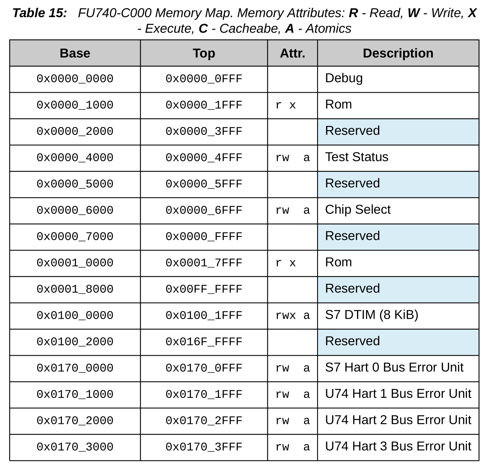
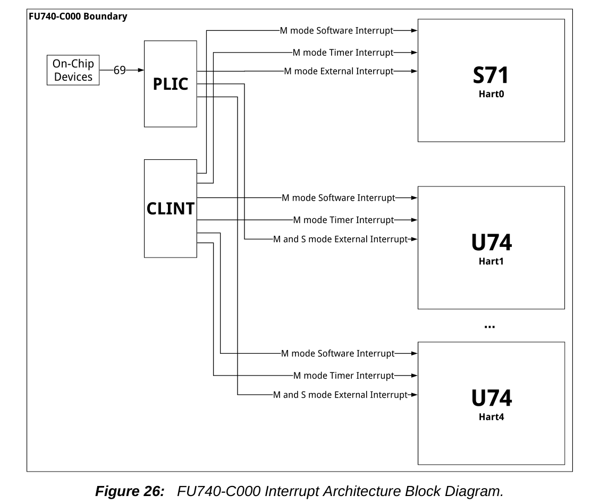
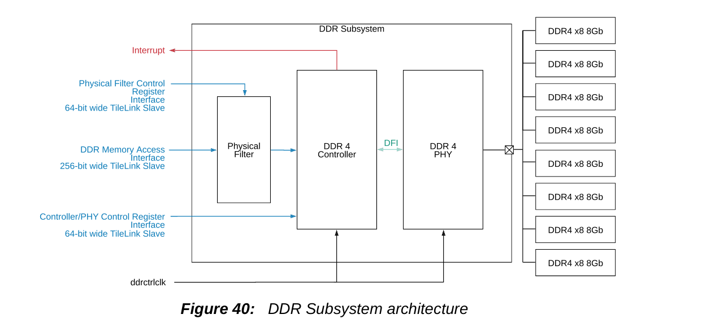
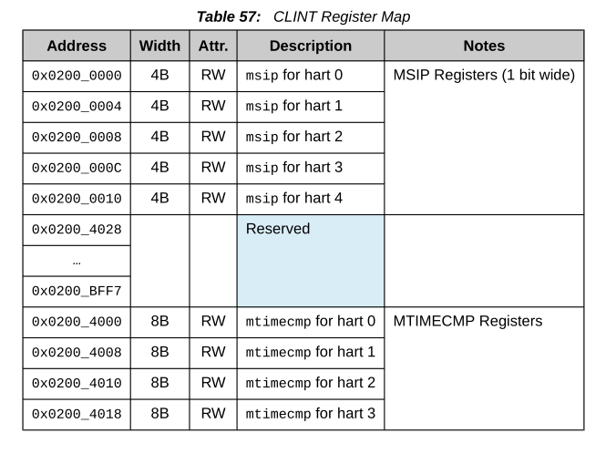
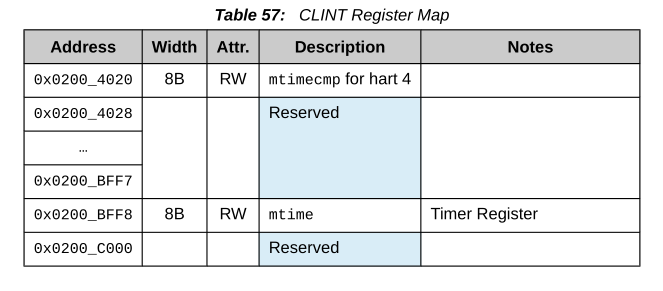

## FU740-C000

#### S7 RISC-V Core

>   The 64-bit S7 RISC-V processor core, intruction fetch and execution unit, L1 and L2 memory systems, Physical Memory Protection Unit, Hardware Performance Monitor, and external interfaces.

-   **ISA**: RV64IMAC
-   **Modes**: Machine mode, user mode

##### DTIM (Data Tightly-Integrated Memory)

-   consists of on-core-complex data and the ports in the FU740-C000 memory map

    

-   deterministic access time

#### Boot Process

-   **ZSBL**: Contained in a masked ROM at 0x10000, responsible for downloading the more complicated U-Boot SPL from a GUID Partition
-   **SPL**: Jump to DDR memory (0x8000_0000)
-   **OpenSBI**: responsible for providing the Supervisor Binary Interface (SBI) as well as emu-
    lating any RISC-V required instructions that are not implemented by the chip itself.
-   **U-Boot**: manages which the hardware that is used to load the kernel.

#### Interrupts

-   FU740-C000 Interrupt Architecture

    

<h4 id="ddr">DDR Subsystem</h4>

-   DDR Subsystem Architecture

#### CLINT

-   **msip**：useful for interprocessor communication in multi-hart systems, as harts may write each other's msip bits to effect interprocessor interrupts
-   **mtimecmp**：timer interrupt is pending whenever mtime is greater than or equal to the value in the mtimecmp register.
-   memory map for CLINT on FU740-C000:

