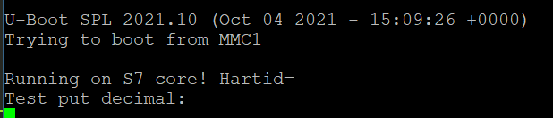
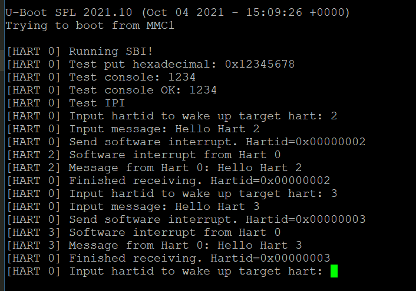

#### 移植uCore-SMP

-   重现陶天骅学长的工作，进一步了解环境配置和编译流程

#### 移植zCore

-   将[`zCore2Hifive`](https://github.com/tkf2019/zCore2HiFive)克隆到本地，打开zCore

-   在`zCore/src/platform/riscv/consts.rs`中将物理地址的起始位置修改为`0x8000_0000`，并添加对应feature

    ```makefile
    # zCore/src/platform/riscv/consts.rs
    if #[cfg(feature = "board_fu740")] {
        pub const KERNEL_OFFSET: usize = 0xFFFF_FFFF_8000_0000;
        pub const PHYS_MEMORY_BASE: usize = 0x8000_0000;
        pub const PHYS_MEMORY_END: usize = 0xC000_0000;
    }
    # Makefile
    ifeq ($(PLATFORM), fu740)
    	features += board_fu740 link_user_img
    ```

-   在`zCore/src/platform/riscv/entry.rs`中添加boot entry

-   执行以下命令生成镜像

    ```shell
    make riscv-image
    cd zCore
    make MODE=release LINUX=1 ARCH=riscv64 PLATFORM=fu740
    make fu740 MODE=release LINUX=1 ARCH=riscv64 PLATFORM=fu740
    ```

-   在官网下载编译好的[freedom-u-sdk](https://github.com/sifive/freedom-u-sdk/releases/download/2021.09.00/demo-coreip-cli-unmatched-2021.09.00.rootfs.wic.xz)，windows上可以用rufus将其装入SD卡中

-   打开SD卡，将制作好的zCore镜像`zcore-fu740`复制到/boot文件夹下，修改/boot中的配置文件extlinux/extlinux.conf，将默认的image.gz改为zCore镜像的文件名`zcore-fu740`


-   将SD卡插入主机，连接串口（串口相关参见中文文档）后启动并进入u-boot，执行`printenv`查看`boot_targets`，mmc0为SD卡启动，执行`setenv boot_targets mmc0`，再执行`boot`即可启动zCore

#### 启动S7

-   OpenSBI首先进行一系列初始化，然后进行二级跳转到uboot，由于uboot运行在S态，无法在S7上加载程序，因此要重新配置OpenSBI
-   论坛上的一个建议：可以通过向S7发送软件中断来唤醒，让S7跳转到事先准备好的中断处理程序中，最后返回到S7上运行的OS中
-   OpenSBI：系统调用；BootLoader
-   U-Boot最新版本有小问题，建议使用2019版本
-   （2021.11.25）关于编译链的简介，可以看出需要从bitbake的配置文件入手，对编译依赖进行管理，可能会修改U-Boot SPL源码
-   （2021.11.27）阅读Freedom-U-SDK的生成的环境和配置文件，发现在`meta-sifive`中关于`unmatched`的相关配置
-   （2021.11.30）U54-MC多核启动流程：
    -   U54和U74架构基本一致
    -   BootROM将SD卡指定分区中的代码加载到L2
    -   L2可运行自己的多核代码，替代U-Boot SPL的功能
    -   启发：U-Boot虽然好用，但是过重，不容易入手修改且调试困难，因此需要参考U-Boot SPL中的配置再重新编写启动代码
-   （2021.12.02）考试结束，重启工作，试图分离U-Boot SPL失败，不过定位到了配置代码，此外在官网找到了[freedom-fu540-c000-bootloader](https://github.com/sifive/freedom-u540-c000-bootloader)，也是从前天的讲座中获得了提示，开始往u540的板子相关工具链寻找参考，发现确实这方面已经非常完善了，于是开始拿来复用和修改，修改过程中加入了小核的启动，加入新的想法：
    -   增加交互控制，通过串口告知启动小核还是大核
    -   由于有两个串口，可以分别启动进行展示（进行hartid的判断，对串口的MMIO地址进行选择
    -   大小核通过MMIO的原子操作可以实现简单的通信
-   （2021.12.03）进行了以下几个方面代码的编写和学习：
    -   GPT（GUID分区表）
    -   SD
    -   FDT（设备树
-   （2021.12.04）FSBL运行失败，和luojia讨论后，决定先结合OpenSBI、FSBL、U-Boot实现可以多核通信的SBI
-   （2021.12.05）编写SBI代码，相关说明参见SBI-SMP
-   （2021.12.06）调试SBI，尝试在FU740上运行制作好的镜像
-   （2021.12.07）调整串口驱动，Debug
-   （2021.12.08）成功在小核上运行程序并看到串口输出

-   （2021.12.09）完成大小核简单通信demo，当前通信采用阻塞方式，具体参见SBI文档

-   （2021.12.10）尝试完善SBI的中断异常处理（未完成）
#### SBI for tCore

* 


#### （附）相关工具

##### U-Boot 常用命令

- **loadb**：通过串口下载二进制文件
- **printenv**：打印环境变量，包括启动设备和起始地址等
- **setenv**：设置环境变量，例如boot之后运行的脚本选项：
    - **baudrate**：串口波特率，默认为115200
    - **boot_targets**：列表包含nvme0，usb0，mmc0等，其中nvme0为SSD卡，我们拿到的主机上已装好了ubuntu系统；usb0为外接USB设备，mmc0即为SD卡，将该选项改为mmc0即可；
    - 此外还包含一些网络相关的配置，可以从远程加载系统
- **fdt print /cpus；fdt list /cpus**：查看设备信息，如图；可以看到cpu相关信息，大核和小核的架构不同，小核不支持页表，不支持浮点运算，且没有**d-cache**

##### U-Boot 目录结构
```log
.
├── api
├── arch
├── board
├── boot
├── cmd
├── common
├── config.mk
├── configs
├── disk
├── doc
├── drivers
├── dts
├── env
├── examples
├── fs
├── include
├── Kbuild
├── Kconfig
├── lib
├── Licenses
├── MAINTAINERS
├── Makefile    
├── net
├── post
├── README
├── scripts
├── test
└── tools
```

* /arch：与指令架构相关的代码，内容包括cpu相关代码，设备树相关代码，例如fu740的相关代码位于`/arch/riscv/cpu/fu740`下
* /boot：
* /board：与开发板相关的代码，例如unmatched的代码位于`/board/sifive/unmatched`下
* /common：通用函数代码，包括环境加载、终端交互等
* /include：头文件和开发板配置文件，所有开发板的配置文件在`/include/configs`目录下，例如unmatched相关配置在`/include/configs/sifive-unmatched.h`内
* /drivers：设备驱动程序，主要有网络接口、串口等，例如sifive串口驱动位于`/drivers/serial/serial_sifive.c`内

##### SPL

* SPL（Secondary Program Loader）是U-Boot第一阶段执行的代码，负责将U-Boot第二阶段执行的代码加载到内存中运行
* SPL复用了U-Boot里面的代码，用来衔接SRAM和U-Boot
* 通过编译选项将SPL和U-Boot代码分离、复用，即`CONFIG_SPL_BUILD`，在`make Kconfig`的时候使能，最终编译生成的二进制文件有`u-boot-spl`、`u-boot-spl.bin`以及`u-boot-spl.map`

##### SD卡默认分区简介

- U-Boot SPL
- U-Boot ITB（DTB with U-Boot overlay，OpenSBI generic FW_DYNAMIC，U-Boot proper）
- FAT16分区，命名为**boot**，包含设置信息(EXTLINUX configuration)，内核镜像以及设备树信息(device tree blob)
- EXT4分区，命名为**root**，包含由**FUSDK**构建的文件系统


##### risc-v gcc

* -march：指定目标平台所支持的模块化指令集合
* -mabi：指定目标平台所支持的ABI函数调用规则
  * 前缀`ilp32`表示32位架构，int和long长度为32位，long long长度为64位
  * 前缀`lp64`表示64位架构，int长度为32位，long长度为64位
  * 后缀类型：
    * 无后缀：如果使用了浮点类型的操作，直接使用RISC-V浮点指令进行支持，但是当浮点数作为函数参数进行传递时，浮点数需要通过堆栈进行传递
    * f：表示目标平台支持硬件单精度浮点指令，且浮点数作为函数参数进行传递时，单精度浮点数可以通过寄存器传递，但双精度浮点数需要通过堆栈进行传递
    * d：表示目标平台支持硬件双精度浮点指令，且浮点数作为函数参数进行传递时，单精度和双精度都可以通过寄存器传递
* -mcmodel：用于指定寻址范围的模式：
  * `-mcmodel=medlow`：寻址范围固定在-2GB到2GB的空间内
  * `-mcmodel=medany`：寻址范围可以在任意4GB空间内
* 由于S74核只支持IMAC指令集，因此本项目中采用`-march=rv64imac -mabi=lp64 -mcmodel=medany`的组合

##### Sifive FUSDK

* 主要用途
  * 为Qemu、Unleashed、Unmatched构建预先定义的磁盘镜像
  * 构建个性化第三方镜像
  * 基于OpenEmbedded（提供交叉编译环境，为嵌入式系统构建完整的Linux
  * 构建Bootloader（OpenSBI、U-Boot、U-Boot SPL
  * 构建Device Tree（DTB
  * 构建Linux镜像
  * 磁盘分区

* 以`demo-coreip-cli`镜像为例，在Unmatched上构建镜像，相关命令如下：

```shell
mkdir riscv-sifive && cd riscv-sifive
repo init -u git://github.com/sifive/freedom-u-sdk -b 2021.10 -m tools/manifests/sifive.xml
repo sync
# optional
repo start work --all
# Setting up Building Environment
bash ./freedom-u-sdk/setup.sh
# BitBake
PARALLEL_MAKE="-j 4" BB_NUMBER_THREADS=4 MACHINE=unmatched bitbake demo-coreip-cli
```

* 最后将镜像写入uSD Card：

```shell
xzcat demo-coreip-cli-unmatched.wic.xz | sudo dd of=/dev/sdX bs=512K iflag=fullblock oflag=direct conv=fsync status=progress

```

##### BitBake

* BitBake是一个Python程序，由用户创建的配置驱动，为用户指定的目标执行用户创建的任务（recipes）；解决依赖关系；提供可配置的方式，将一些常见的任务例如下载源码包、解压、运行configure、运行make等进行抽象封装和重用
* BitBake可以从[这里](https://github.com/openembedded/bitbake)进行下载，按照文档的要求，将仓库下载到指定地址后，可以在`.bashrc`或`.zshrc`等配置文件中添加（建议先根据需求确定好版本，执行`bitbake --version`检查安装是否成功及当前版本

```shell
export PATH=/path/to/bbtutor/bitbake/bin:$PATH
export PYTHONPATH=/path/to/bbtutor/bitbake/lib:$PYTHONPATH
```
##### GPT

```c
// GPT header
typedef struct {
  uint64_t signature;
  uint32_t revision;
  uint32_t header_size;
  uint32_t header_crc;
  uint32_t reserved; // Reserved part must be 0x0
  uint64_t current_lba;
  uint64_t backup_lba;
  uint64_t first_usable_lba;
  uint64_t last_usable_lba;
  gpt_guid disk_guid;
  uint64_t partition_entries_lba;
  uint32_t num_partition_entries;
  uint32_t partition_entry_size;
  uint32_t partition_array_crc;
  uint32_t padding;
} gpt_header;
```

* 特点：
  * 64位LBA，可管理空间很大
  * 128位GUID标识，不容易产生冲突
  * 不限制分区数量
  * 磁盘首尾各带一个表头，抗性较高
  * 提供CRC校验